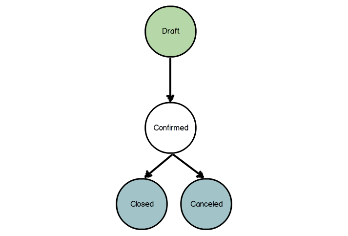

==========
Pengenalan
==========

Workflow adalah ketentuan alur yang dibuat untuk mempermudah jalannya
sebuah bisnis proses. Di dalam workflow, terdapat dua komponen di dalam workflow,
komponen tersebut adalah ``activity`` dan ``transition``. Komponen ``activity``
mempunyai fungsi sebagai sebuah perhentian sebelum berjalan ke ``activity`` lain.
Ketika memasuki ``activity``, sebuah proses dapat ditambahkan, sehingga proses
yang ditambahkan dapat dijalankan ketika awal masuk ``activity``. Proses di dalam
``activity`` hanya dijalankan hanya **satu kali (1x)**.

Pasangan dari komponen ``activity`` adalah komponen ``transition``. Komponen
``transition`` berfungsi sebagai jembatan yang menggabungkan antara dua ``activity``.
Komponen ``transition`` berisi pertanyaan dari kondisi sekarang, apakah dapat
lewat atau tidak. Pertanyaan kondisi akan selalu ditanyakan ketika data yang
berhubungan dengan workflow berubah.

```xml
<?xml version="1.0" encoding="UTF-8"?>
<efitrac>
    <workflows>
        <workflow id="workflow_1" name="Workflow Order">
            <properties>
                <property name="service">mock.service.WorkflowOrderService</property>
            </properties>
            <activities>
                <activity id="act_1" name="Action 1">
                    <properties>
                        <property name="flag">start</property>
                        <property name="kind">dummy</property>
                        <property name="action" />
                        <property name="split_mode">xor</property>
                        <property name="join_mode">xor</property>
                    </properties>
                </activity>
            </activities>
            <transitions>
                <transition id="transition_1" name="Transition 1">
                    <properties>
                        <property name="condition" />
                        <property name="signal" />
                        <property name="seqNo">100</property>
                        <property name="source">act_1</property>
                        <property name="destination">act_2</property>
                    </properties>
                </transition>
            </transitions>
        </workflow>
    </workflows>
</efitrac>
```

Workflow mempunyai attribute yang harus ada, yaitu ``id`` dan ``name``. Seperti
namanya, kedua attribute tersebut digunakan sebagai identifier dan nama dari
workflow. Selain itu workflow juga mempunyai property yang harus ada, yaitu:

- ``service``
    ```xml
    <properties>
        <property name="service">mock.service.WorkflowOrderService</property>
    </properties>
    ```
    Setiap proses yang terjadi pada workflow berasal dari function yang dipunyai
    sebuah **interface** class. Property ``service`` mendefinisikan di mana
    class tersebut.



Gambar di atas merupakan contoh sedehana dari diagram workflow.


Activity
--------

```xml
<activities>
    <activity id="act_1" name="Action 1">
        <properties>
            <property name="flag">START</property>
            <property name="kind">DUMMY</property>
            <property name="action" />

            <!-- On Going -->
            <!-- <property name="split_mode">XOR</property> -->
            <!-- <property name="join_mode">XOR</property> -->
        </properties>
    </activity>
</activity>
```

Contoh potongan xml di atas adalah definisi xml dari ``activity``. Dimulai dengan
tag ``<activity>``, definisi komponen ``activity`` pun dimulai. Ada beberapa
attribute yang harus ada, yaitu ``id`` dan ``name``. Attribute ``id`` digunakan
sebagai identified dan ``name`` digunakan sebagai nama dari ``activity``.

Seperti yang komponen lainnya, ``activity`` pun mempunyai property-property yang
harus ditentukan. Berikut adalah daftar property beserta penjelasannya,

- ``flag``
    ```xml
    <property name="flag">START</property>
    ```
    Bernilai ``START``, ``NONE``, atau ``STOP``. Property ``flag`` mempunyai fungsi
    sebagai penanda apakah ``activity`` merupakan awalan, akhiran, atau bukan
    keduanya. Nilai awal adri property ini adalah **NONE**.

- ``kind``
    ```xml
    <properties>
        <property name="kind">DUMMY</property>
    </properties>
    ```
    Bernilai ``FUNCTION``, ``DUMMY``, ``SUBFLOW``, atau ``STOP ALL``. Masing-masing
    mempunyai penjelasan sebagai berikut,

    - ``FUNCTION``
        Ketika alur masuk ke ``activity``, function yang didaftarkan pada
        property ``action`` akan dijalankan.

    - ``DUMMY``
        Jenis ini tidak mempunyai fungsi apapun, melainkan hanya sebagai
        ``activity`` kosong yang digunakan sebagai jembatan ke ``activity``
        lainnnya. Jenis ini dijadikan sebagai **nilai awal** dari property
        ``kind``.

    - ``SUBFLOW``
        Menyisipkan ``workflow`` lain ke dalam ``workflow`` yang sekarang adalah
        fungsi dari jenis ``subflow``. Workflow tersebut akan dianggap seperty
        ``activity`` dan jika workflow tersebut sudah selesai, maka ``activity``
        juga dianggap sudah selesai.

    - ``STOP ALL``
        Menghentikan semua proses pada ``workflow``.

    Nilai awal dari property ini adalah ``DUMMY``.

- ``action``
    ```xml
    <properties>
        <property name="action">isPaid()</property>
    </properties>
    ```
    Nilai dari property ``action`` adalah nama dari function yang ada di interface
    class yang didefinisikan oleh ``workflow``. Nama dari function diakhiri dengan
    tanda kurung buka dan kurung tutup.

- ``split_mode``
    ```xml
    <properties>
        <property name="split_mode">XOR</property>
    </properties>
    ```
    Bernilai ``XOR``, ``OR``, dan ``AND``. Property ini mengatur alur keluar dari
    ``activity``. Berikut adalah penjelasan dari nilai ``split_mode``,

    - ``XOR``
        Nilai ini mempunyai arti, jika ada ``transition`` yang bernilai ``TRUE``,
        maka akan masuk ke ``transition`` yang bernilai ``TRUE`` dan yang ditemui
        pertama kali.

    - ``OR``
        Semua ``transition`` akan dilewati. Jika ada ``transition`` yang bernilai
        ``FALSE``, maka akan ditunggu sampai bernilai ``TRUE``.

    - ``AND``
        Berbeda seperti ``OR``, nilai ``AND`` menunggu semua ``transition``
        bernilai ``TRUE``.

    Nilai awal property ``split_mode`` adalah ``XOR``.

.. - ``join_mode``
    ```xml
    <properties>
        <property name="join_mode">XOR</property>
    </properties>
    ```
    Bernilai ``XOR`` dan ``AND``.  Property ``join_mode`` mengatur masuknya
    ``transition`` ke ``activity``. Untuk nilai ``XOR``, apa pun ``transition``
    yang masuk akan menjalankan ``activity``. Sedangkan ``AND``, menunggu semua
    ``transition`` yang masuk bernilai ``TRUE``.

- ``subflow``
    ```xml
    <properties>
        <property name="subflow">flow_id_1</property>
    </properties>
    ```
    ID dari ``workflow`` yang akan dijadikan subflow.

- ``subflow_signal``
    ```xml
    <properties>
        <property name="subflow_signal">subflow.canceled</property>
    </properties>
    ```
    Signal yang didapatkan dari subflow. Signal yang dimaksud didapat dari sedang
    berada di ``activity`` mana subflow tersebut. Nilai dari property ini diawali
    dengan kata "subflow" dan symbol titik (.) ("subflow.").

Transition
----------
```xml
<transitions>
    <transition id="transition_1" name="Transition 1">
        <properties>
            <property name="condition" />
            <property name="signal" />
            <property name="seqNo">100</property>
            <property name="source">act_1</property>
            <property name="destination">act_2</property>
        </properties>
    </transition>
</transitions>
```
Transition adalah jembatan antara dua ``activity``. Di dalam ``transition`` ada
pengecekan bersifat logical, di mana jika kondisi terpenuhi, maka berjalanlah
alur yang ditentukan. Kondisi yang dapat mempengaruhi adalah sebagai berikut,

- Condition
    Sebuah Expression atau function yang mempunyai nilai kembalian ``boolean``.

- Signals
    Kondisi didapat dari tombol (button). Jika ditekan tombol tertentu maka
    akan bernilai ``TRUE``.

Kedua kondisi tersebut dapat ditentukan pada bagian property. Selain kedua property
tersebut, ada juga beberapa yang lainnya, yaitu sebagai berikut,

- ``seqNo``
    Jika ada ``transition`` yang mempunyai level yang sama, maka akan dicek menurut
    seqNo (sequence number).

- ``source``
    ID dari ``activity`` sumber.

- ``destination``
    ID dari ``activity`` tujuan.


.. _Pengenalan: https://github.com/pararaton/modular/wiki/Workflow#pengenalan