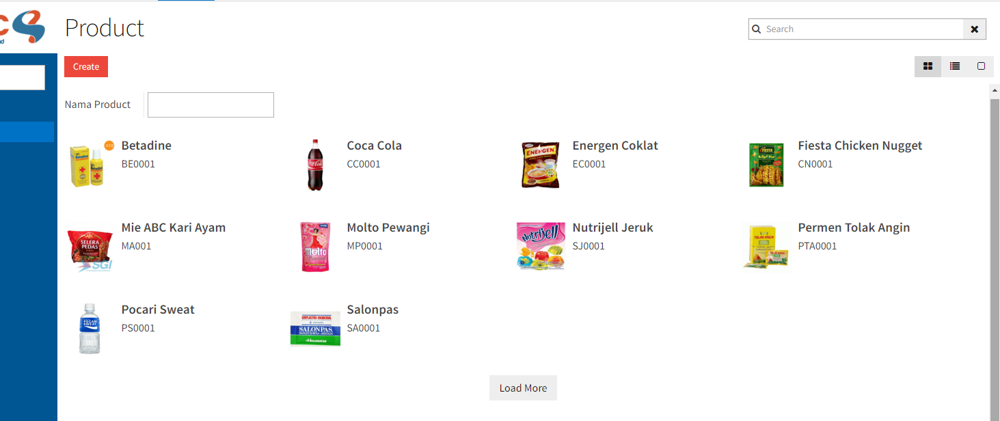

# Overview
Sebuah kanban view dapat menampilkan item dalam bentuk thumbnail. Setiap thumbnail merupakan represntasi dari sebuah record. Root element adalah `<kanban>`.
Untuk membuat sebuah template kanban view dibuat digunakan <a href="http://velocity.apache.org/">**Apache Velocity**</a>.
Untuk mempelajari lebih lanjut Apache velocity dapat diliat pada <a href="http://wiki.apache.org/velocity/FrontPage">Dokumentasi Apache Velocity</a>.

Contoh kanban view:



```xml
<record model="ir.ui.view" id="product_product_kanban_view">
	<field name="name">product.product.kanban</field>
	<field name="model">product.product</field>
	<field name="arch" type="xml">
		<kanban string="Product">
			<header>
				<horizontallayout width="100%" margin="true,false,true,false">
					<formlayout>
						<field name="name" view_item_amount="all"/>
					</formlayout>
				</horizontallayout>
			</header>
			<template class="oe_kanban_global_click" function="getCustomParameter">
				<![CDATA[
					<div class="partner-item" style="width: 300px;padding: 10px;margin-right: 10px;">
						</img>
						<span style="width:200px;display:inline-block">
							<b style="font-size: 1.2em;">$name</b>
							#if ($code)
								<div>$code</div>
							#end
							#if ($categories)
								<div>$categories</div>
							#end
						</span>
						<button name="open_product_form" onclick="efitrac.globalFunction.action(this.name,this.context,$id)" style="float:left;visibility:hidden">VIEW</button>
					</div>
				]]>
			</template>
		</kanban>
	</field>
</record>
```


---

## How to build kanban view?

Dibawah ini ada beberapa element dan attribute yang ada di dalam sebuah kanban:

### Template Kanban Item
Untuk membuat tampilan template kanban harus dibungkus menggunakan tag `<template>` dan diletakan di dalam tag `<kanban>` seperti dibawah ini.

```xml
	<template>
		<![CDATA[
			...
		]]>
	</template>
```

Di dalam `CDATA`, kita bisa mulai membuat tampilan template menggunakan aturan **Apache Velocity**.

### Kanban Filter

Selain itu pada ada kanban bisa ditambahkan tampilan filter tambahan untuk memfilter data kanban yang ditampilkan dengan menambahkan definisi filter pada tag `<header>`.
Jika tidak mau menggunakan filter maka tag `<header>` tidak perlu digunakan.

```xml
	<header>
		<horizontallayout>
			<formlayout>
				<field name="xxx"/>
			</formlayout>
		</horizontallayout>
	</header>
```

Semua tag `<field>` yang ditemukan didalam tag `<header>` akan berfungsi sebagai filter.

### Kanban Item Click

Setiap kanban Item, bisa diklik dan ada 2 jenis tipe klik yang bisa digunakan:

1. Action Click

```xml
	<button name="function_button_name" onclick="efitrac.globalFunction.action(this.name,this.context,$id)">VIEW</button>
```
Ketika kanban item di klik, halaman akan diredirect ke view baru sesuai definisi dari isi function tersebut. 

2. PopUp Click

```xml
	<button name="function_button_name" onclick="efitrac.globalFunction.window(this.name,this.context,$id)">VIEW</button>
```
Ketika kanban item di klik, akan muncul popup view baru sesuai definisi dari isi function tersebut.

Pada item kanban, jika ingin menentukan button mana yang akan digunakan sebagai default klik pada item kanban, dapat dilakukan dengan menambahkan attribute `class="oe_kanban_global_click` pada tag `<template>`.
Attribute tersebut gunanya untuk membuat default klik item kanban sesuai dengan button yang ditemukan pertama kali 


### Custom Function

```xml
	<template class="oe_kanban_global_click" function="getCustomParameter">
		<![CDATA[
			<div>
				<b>$name</b>
				<div>$customParameter</div>				
			</div>
		]]>
	</template>
```

Function `getCustomParameter` ini digunakan untuk membantu meresolve variabel dalam mengaplikasikan **Apache Velocity**.
Contoh isi dari function `getCustomParameter` adalah sebagai berikut:

```java
	/**
     * 
     * @param id adalah id dari item kanban yang diklik
     * @return
     */
	public Map getCustomParameter(Integer id){
		Map<String,Object> result=new HashMap<>();

		//Menentukan field apa saja yang dibutuhkan
        Set<String> readfields = new HashSet<>();
        readfields.add("name");
        readfields.add("code");
		
		//Browse data sesuai id yang sedang aktif
        Map<String, Object> data = PoolCache.getModel("module.dummy").get().browseN(id).toReadValueMap(readfields, true);
		//Masukan semua data ke result
        result.putAll(data);

        //Menambahkan custom parameter
        result.put("customParameter", "ini custom parameter");

        return result;
    }
```

Value yang sesuai dari key pada hashmap result, akan menggantikan variabel dengan prefix `$` pada kanban template. 
Contohnya: value pada key `code` akan menggantikan `$code`.

### Attribute `showall`

Secara default, data yang diloadkan pada kanban berjumlah 40 item. Untuk menampilkan semua data tanpa perlu adanya button **Load More** bisa menambahkan attribute `showall=true` pada tag `<kanban>`.

```xml
	<kanban string="Product" showall="true">
```
