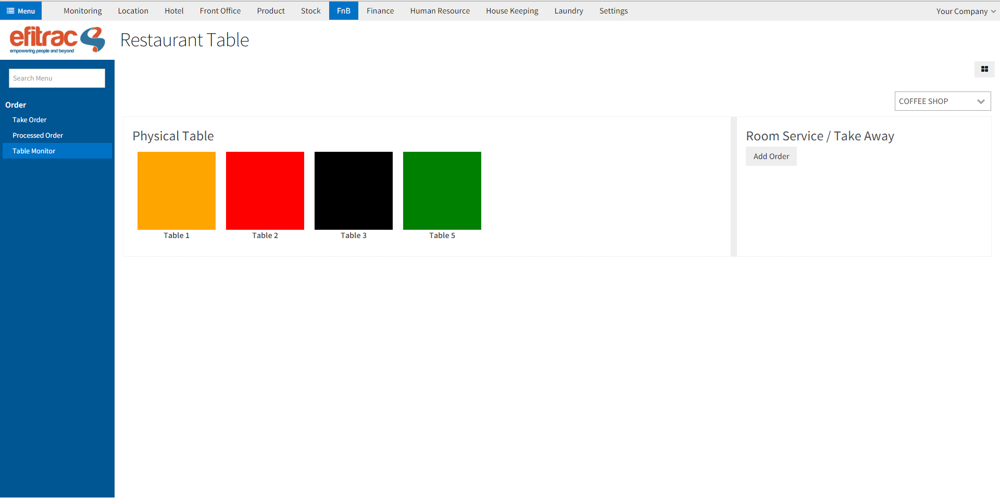

# Overview
Custom View adalah sebuah view yang bisa dibuat sesuai keinginan developer menggunakan komponen-komponent vaadin.
View ini dibuat dengan meng-extend class **CustomViewLayout**

---

## CustomViewLayout
Class ini merupakan class induk untuk membuat tampilan custom view. Di dalam class ini terdapat function-function pendukung seperti :

* getModelRef : Digunakan untuk mendapatkan referensi model dari view ini
* getParent : Digunakan untuk mendapatkan parent dari view ini
* getXMLNode : Digunakan untuk mendapatkan node xml dari view ini
* getAttribute : Digunakan untuk mendapatkan attribute dari xml element untuk view ini

## How to build a custom view?

Untuk membuat sebuah custom view ada 2 langkah mudah yang harus dilakukan:

### Membuat java class dari custom view

Untuk membuat custom view, view tersebut harus extend dari *CustomViewLayout*.
Dibawah ini contoh cara membuat class CobaCustomView.

```java
public class CobaCustomView extends CustomViewLayout {

    VerticalLayout view=new VerticalLayout();

    public CobaCustomView(ViewPage parent, AbstractModel model,Node node) {
        super(parent, model,node);
    }

	/**
     * digunakan untuk merender view yang akan ditampilan
     * @return
     */
    @Override
    public void render() {
        Map<String, Field> fields = getModelRef().getFields();

        /**
			CODE YOUR VIEW HERE
		**/
    }

	/**
     * digunakan untuk mengembalikan view yang akan ditampilan
     * @return
     */
    @Override
    public Layout getComponent() {
        return view;
    }

}
```
### Menggunakan custom view menggunakan xml

Kemudian, custom view tersebut dapat digunakan dengan cara biasanya, menggunakan xml.
Contoh cara penggunaan custom view tersebut pada xml.

```xml
<field name="arch" type="xml">
	<custom string="Coba Custom" source="com.efitrac.module.xxx.CobaCustomView">
	</custom>
</field>
```

Pada contoh code diatas, kita dapat menggunakan custom view tersebut dengan menggunakan tag `<custom>`
dan diberi attribute `source` untuk menentukan letak dimana file java dari custom view tersebut berada. 
Di dalam tag custom juga bisa diberi tag-tag yang lain sesuai kebutuan dari developer.

### Contoh Penggunaan custom view

Di bawah ini adalah custom view order monitor sebuah restoran:



Di bawah ini ada cara membuatan custom view order monitor tersebut:

```java
	public class OrderMonitorCustomView extends CustomViewLayout {
    Integer uid= ServiceBeanResolver.getUserService().getActiveUser().getId();

    VerticalLayout view=new VerticalLayout();
    CssLayout tableOrderContainer = new CssLayout();
    CssLayout roomOrderContainer = new CssLayout();

    public OrderMonitorCustomView(ViewPage parent, AbstractModel model,Node node) {
        super(parent, model,node);

        Page.Styles styles = Page.getCurrent().getStyles();
        //inject style for ordermonitor item
        styles.add(".ordermonitor .status-red{ background-color:red; }");
        styles.add(".ordermonitor .status-black{ background-color:black;color:white }");
        styles.add(".ordermonitor .status-green{ background-color:green; }");
        styles.add(".ordermonitor .status-orange{ background-color:orange; }");
        styles.add(".ordermonitor .status-navy{ background-color:navy; }");
        styles.add(".ordermonitor .status-grey{ background-color:grey; }");

        //inject style for table process modal
        styles.add(".openProcessTable .btn-purple{ background-color:purple;color:white }");
        styles.add(".openProcessTable .btn-green{ background-color:green;color:white }");
        styles.add(".openProcessTable .btn-blue{ background-color:blue;color:white }");
        styles.add(".openProcessTable .btn-orange{ background-color:orange;color:white }");
        styles.add(".openProcessTable .btn-black{ background-color:black;color:white }");
    }

    /**
     * digunakan untuk merender view yang akan ditampilan
     * @return
     */
    @Override
    public void render() {
        view.addStyleName("ordermonitor");
        view.setMargin(true);
        view.setSpacing(true);

        HorizontalLayout headerView=new HorizontalLayout();
        headerView.setWidth("100%");
        view.addComponent(headerView);

        ComboBox outletType=new ComboBox();
        Container containerOutlet = new IndexedContainer();
        outletType.setNullSelectionAllowed(false);
        outletType.setTextInputAllowed(false);
        outletType.setItemCaptionMode(AbstractSelect.ItemCaptionMode.PROPERTY);
        outletType.setItemCaptionPropertyId("value");
        containerOutlet.addContainerProperty("value", String.class, (Object) null);
        outletType.setContainerDataSource(containerOutlet);
        outletType.setImmediate(true);
        headerView.addComponent(outletType);
        headerView.setComponentAlignment(outletType, Alignment.MIDDLE_RIGHT);


        HorizontalSplitPanel centerView=new HorizontalSplitPanel();
        view.addComponent(centerView);
        centerView.setWidth("100%");
        centerView.setSplitPosition(70, Sizeable.Unit.PERCENTAGE);
        centerView.addStyleName("large");

        // table monitor
        VerticalLayout tableOrder = new VerticalLayout();
        tableOrder.setMargin(true);
        centerView.setFirstComponent(tableOrder);

        Label tableOrderTitle = new Label();
        tableOrderTitle.addStyleName("huge");
        tableOrderTitle.setValue("Physical Table");

        tableOrder.addComponent(tableOrderTitle);
        tableOrder.addComponent(tableOrderContainer);

        // room monitor
        VerticalLayout roomOrder = new VerticalLayout();
        roomOrder.setMargin(true);
        centerView.setSecondComponent(roomOrder);

        Label roomOrderTitle = new Label();
        roomOrderTitle.addStyleName("huge");
        roomOrderTitle.setValue("Room Service / Take Away");
        Button roomOrderButton=new Button();
        roomOrderButton.setCaption("Add Order");

        roomOrder.addComponent(roomOrderTitle);
        roomOrder.addComponent(roomOrderButton);
        roomOrder.addComponent(roomOrderContainer);

        //isi content outlet type
        Integer defaultOutletId=1;
        Optional<Outlet> mOutlet = ModelUtil.<Outlet>getModel("hotel.outlet");
        if(mOutlet.isPresent()){
            Outlet outlet = mOutlet.get();
            List<Integer> searchOutlet = outlet.searchN(new ArrayList<Object>(), 0);
            AbstractModel browseOutlet = outlet.browseN(searchOutlet);
            for(AbstractModel o:browseOutlet){
                String name= "";
                Optional<Object> oName = o.get("name");
                if(oName.isPresent()){
                    name= (String) oName.get();
                }
                Item item = containerOutlet.addItem(o.getId());
                item.getItemProperty("value").setValue(name);
            }

        }

        //set onchange outletType
        outletType.addValueChangeListener(new Property.ValueChangeListener() {
            @Override
            public void valueChange(Property.ValueChangeEvent valueChangeEvent) {
                loadTableOrderData((Integer) valueChangeEvent.getProperty().getValue());
                loadRoomOrderData((Integer) valueChangeEvent.getProperty().getValue());
            }
        });

        //pasang roomOrderButton action
        roomOrderButton.addClickListener(new Button.ClickListener() {
            @Override
            public void buttonClick(Button.ClickEvent clickEvent) {
                //process add order
            }
        });

        outletType.setValue(defaultOutletId);
    }


    private void loadTableOrderData(Integer defaultType) {
        tableOrderContainer.removeAllComponents();

        String domainAsString = "[('outlet_id', '=',"+defaultType+" )]";
        Domain domain = new Domain.Builder(domainAsString).build();
        List<Integer> searchResult = getModelRef().searchN(uid, domain.toObjectList(), 0, 0, null, null, false, null);
        AbstractModel data = getModelRef().browseN(searchResult);

        for(final AbstractModel item:data){
            Optional<Object> oName = item.get("name");
            if(oName.isPresent()){
                String name = (String) oName.get();

                OutletTableStatus lastStatus = (OutletTableStatus) item.get("last_table_status").get();

                final AbstractModel fItem = item;
                CssLayout table = addOrderItem(name, lastStatus.getId());
                table.addLayoutClickListener(new LayoutEvents.LayoutClickListener() {
                    @Override
                    public void layoutClick(LayoutEvents.LayoutClickEvent layoutClickEvent) {
                        // process kalau table di klik
                    }
                });

                tableOrderContainer.addComponent(table);
            }
        }
    }
    private void loadRoomOrderData(Integer defaultType) {
        roomOrderContainer.removeAllComponents();
    }


    /**
     * digunakan untuk mengembalikan view yang akan ditampilan
     * @return
     */
    @Override
    public Layout getComponent() {
        return view;
    }

}
```