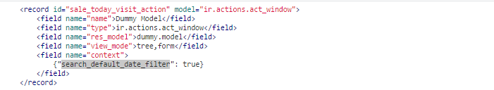
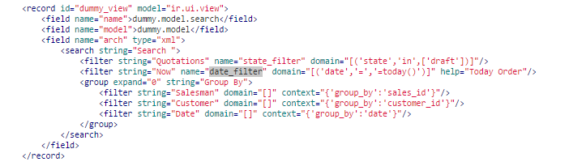
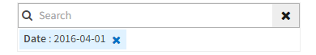

# Overview
Setiap view bisa mempunyai default filter yang di definisikan dari file xml.

---

## How to define default filter?

Ada 2 cara untuk mendefinisikan default filter:

### Default filter by Domain

Cara untuk mendefinisikan default filter by domain adalah dengan cara menambahkan sebuah field *domain* pada ir.actions.act_window.

```xml
	<record id="sale_today_visit_action" model="ir.actions.act_window">
		<field name="name">Dummy Model</field>
		<field name="type">ir.actions.act_window</field>
		<field name="res_model">dummy.model</field>
		<field name="view_mode">tree,form</field>
		<field name="domain">[('date', '=', '=today()')]</field>
	</record>
```
Dengan menambahkan field *domain* pada ir.actions.act_window, ketika halaman tree view terbuka, maka data yang ditampilkan akan sesuai dengan filter domain tersebut.

Hasilnya, pada website data terfilter sesuai domain tersebut.

### Default filter by Context

Cara untuk mendefinisikan default filter by context adalah dengan cara menambahkan sebuah field *context* pada ir.actions.act_window
dengan contoh seperti dibawah ini:



Isi dari context tersebut harus mendefinisikan filter search mana yang akan diaktifkan secara default.
Cara definisi untuk default filter adalah  `{"search_default_xxx": true}`. 
`xxx` adalah nama field search yang akan diaktifkan secara default.

Filter yang diaktifkan tersebut berasal dari sebuah record ir.ui.view dengan tag search pada contoh di bawah ini.



Pada contoh di atas, context berisi `search_default_date_filter` yang berhubungan dengan field `date_filter`.

Hasilnya, pada website akan muncul sebuah filter pada filterbox dan data terfilter sesuai filter tersebut.

