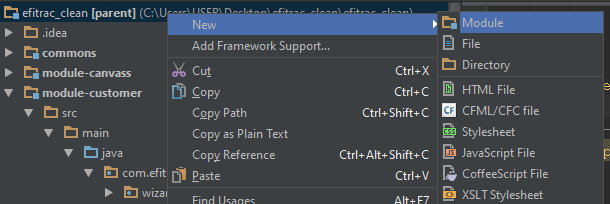
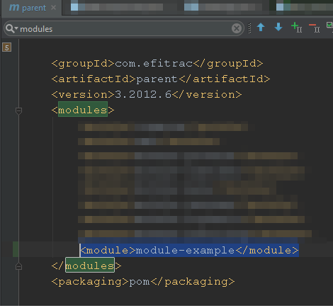

# Overview
Module adalah sebuah package yang berisi beberapa model dan saling berhubungan dalam membentuk sebuah bisnis proses. Sebuah module ada yang saling bergantung pada module yang lainya.

---

## Step by step to create new module use IntelliJ

### Buat module baru pada project

1. Klik kanan parent project, dan pilih New > Module.



2. Pilih maven >> Next.

3. Pada ArtifactId isikan nama module yang baru. contoh: module-example >> Next.

4. Pada module name masukan juga module-example >> Finish.

### Setting file pom.xml module baru

Copy paste file pom.xml dari module lain yang sudah ada ke module baru tersebut, 
lalu edit *artifactId* dan *version* sesuai dengan nama module yang baru. 

```xml
	<artifactId>module-example</artifactId>
    <version>${module-example.version}</version>
```

Setting juga configurasi untuk testing. 
Tepat setelah menyeting artifactId dibawahnya digunakan untuk mensetting test module.
Ubah tag id sesuai nama module yang baru.

```xml
	<id>test-module-example</id>
```

Lalu pada daerah "Efitrac Module Block" tambahkan module lain yang akan diperlukan pada module baru ini.

```xml
	<dependency>
		<groupId>com.efitrac</groupId>
		<artifactId>module-customer</artifactId>
	</dependency>
```

### Setting file pom.xml pada pom parent

Daftarkan module baru tersebut pada pom parent. Caranya: Pada tag modules pada bagian atas, tambahkan module baru tersebut.



Daftarkan profile untuk test module yang baru

```xml
	<profile>
		<id>test-module-example</id>
	</profile>
```

Setelah itu definiskan version untuk module yang baru.

```xml
	<module-example.version>3.0000.1</module-example.version>
```

Kemudian daftarkan pada dependency management agar bisa dipakai oleh module yang lain.

```xml
	<!-- Module Example -->
	<dependency>
		<groupId>com.efitrac</groupId>
		<artifactId>module-example</artifactId>
		<version>${module-example.version}</version>
	</dependency>
```

### Setting file pom.xml pada project yang dipakai

Langkah terakhir, daftarkan dependency di file pom.xml dengan menambahkan pada "Efitrac Module Block". 

```xml
	<dependency>
		<groupId>com.efitrac</groupId>
		<artifactId>module-example</artifactId>
	</dependency>
```

<p style="font-size:18px;text-align:center"> Voila! Your new module looks awesome! </p>
