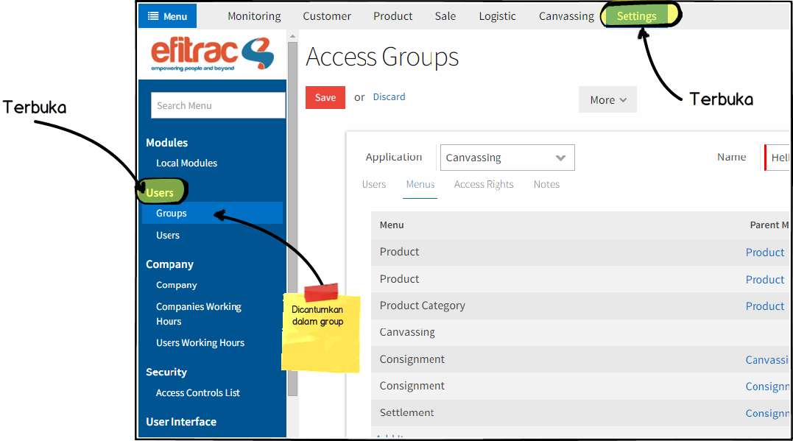
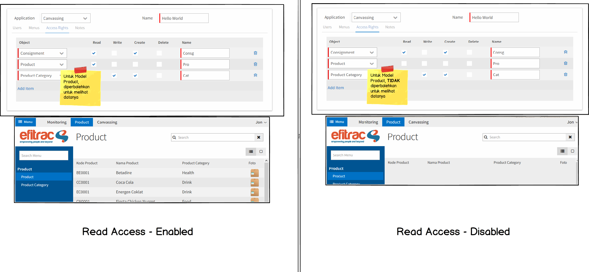

# Access Control List Advance
Halaman ini akan membahas tentang Access Control List secara lebih lanjut dan
disertai gambar yang mempunyai tujuan agar Anda dapat memahaminya dengan
lebih mudah.

---

## Menus
Pengaturan sekuritas dari menu memerlukan ketelitian yang cukup tinggi, apalagi
beberapa menu yang ada mempunyai nama yang sama atau hampir sama. Sesuai dengan
hirarki Menu (lihat [Menu]), Jika menu yang mempunyai *action* dicantumkan pada
sebuah group, maka menu *parent*-nya juga akan terbuka.

---

## Access Rights
Bagian ini akan mengatur tentang *permission* untuk model. Permission yang 
dimaksud ada empat (4) jenis, yaitu **Read**, **Write**, **Create**, dan
**Delete**. Jangan lupa untuk mencantumkan nama dari permission yang dibuat.

### Read Access
Jika seorang user tidak mempunyai permission ini untuk sebuah model, maka user
tersebut sama sekali tidak diperbolehkan untuk membaca data dari model tersebut. 
Jika User diperbolehkan untuk melihat view dari model, tetapi jika dilakukan, 
maka tidak akan ada data yang tampil dalam view tersebut.

### Write Access
User tidak diperbolehkan untuk mengubah data yang ada ketika user tersebut tidak
mempunyai permission ini. Biasanya pada bagian atas tampilan, ada tombol 
**edit**, jika tidak mempunyai persmission ini, maka tombol edit akan tidak
terlihat.

### Create Access
Hampir sama dengan *Write Access*, Create Access memberikan pengaturan agar
user yang tidak mempunyai permission ini tidak dapat menambahkan data baru.
Dapat dilihat dari tombol merah dengan bertuliskan **Create** di atas tampilan
sebuah model.

### Delete Access
Permission untuk Delete Access diguanakan untuk mengatur siapa saja yang 
diperbolehkan untuk menghapus sebuah data dalam model. Jika diperbolehkan,
maka akan ada pilihan **Delete** pada seleksi *More*. Seleksi tersebut hanya ada
ketika masuk ke mode **form**.

[Menu]: ../menu.md