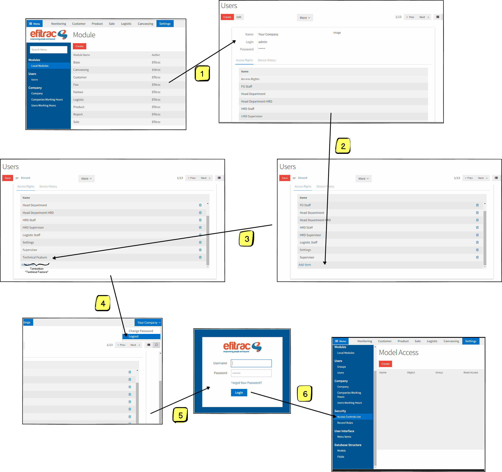

# Overview
Access Control List atau ACL adalah sebuah fitur sekuritas data yang ada
dalam sebuah sistem. ACL akan mengatur seorang user apakah diperbolehkan untuk
membuka sebuah menu, membaca data yang ada, sampai mengganti sebuah nilai pada
data yang sudah ada.

---

## Groups
Di dalam Efitrac, seorang user bisa mempunyai satu atau beberapa *role* atau 
jabatan yang disebut dengan **group(s)**. Group inilah nantinya yang memberikan
sebuah relasi apakah user dengan group **X** boleh melihat data dari tabel 
**A**, dan lain sebagainya.

### Component of Groups
Selain melekat pada user, group sendiri melekat di berbagai komponen pada 
Efitrac. Berikut adalah daftar komponen yang mempunyai atribut group di 
dalamnya:

* Users
* Menus
<!--- * Views --->
* Access Rights
<1--- * Rules --->

### Users
Group dapat disamakan dengan jabatan dalam artian umum. Sehingga group mempunyai
arti jabatan dari seorang user.

### Menus
Dalam menu, group mempunyai tugas untuk menyeleksi apakah user boleh melihat
menu ini atau tidak.
<!---
### Views
Views adalah tampilan yang disajikan kepada *end-user* sehingga dapat melihat
data visualisasi dari sebuah tabel. Group di sini berperan menengahi apakah
seorang user boleh untuk melihat view tersebut atau tidak.
--->
### Access Rights
Access Right mengacu proteksi pada data dari model. Proteksi yang diberikan 
melingkupi empat pertanyaan, yaitu Apakah data boleh **dilihat**, **diubah**, 
**dibuat baru**, dan **dihapus**.  
<!---
### Rules
Mengacu pada data, rule memberikan penyaringan data kepada group agar dapat
melihat data dengan spesifikasi tertentu dalam sebuah model atau tabel.

*p.s. Rule sedang berada dalam proses pengembangan, sehingga fungsionalitasnya
terbatas.*
--->
---

## How To
Untuk mengatur sekuritas Efitrac, seorang user harus mempunyai group yang 
bernama **Technical Feature**. Pada awalnya, tidak ada user yang mempunyai 
group ini, termasuk Administrator. 

### Enable Technical Feature
Untuk memberikan akses, silahkan mengikuti langkah-langkah yang ada pada gambar 
berikut:

Proses **Logout** dan **Login** ulang diperlukan untuk me-*refresh* data yang
telah disimpan di dalam penyimpanan sementara atau sering disebut dengan
**cache**, jika user tersebut adalah *active* user (user yang sedang login).

Sampai dengan tahap ini, Anda sudah dapat mengatur sekuritas Efitrac sesuai
dengan keinginan Anda.

---

## What Next?
Untuk penjelasan lebih lanjut, silahkan kunjungi halaman 
[Access Control List - Adv].
 
[Access Control List - Adv]: access-control-list-adv.md

