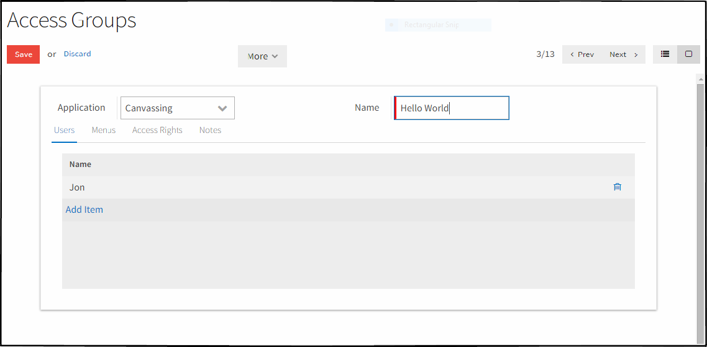

# Overview
Access Control List atau ACL adalah sebuah fitur sekuritas data yang ada
dalam sebuah sistem. ACL akan mengatur seorang user apakah diperbolehkan untuk
membuka sebuah menu, membaca data yang ada, sampai mengganti sebuah nilai pada
data yang sudah ada.

> Perubahan ACL secara **live**, membutuhkan proses *re-log* (logout dan login)
> agar ACL dapat terpasang.

---

# Prerequisite
Pada awalnya, ACL tidak dapat diubah maupun dilihat. Untuk menggunakan
ACL secara penuh, dapat mengikuti cara seperti berikut,

1. Masuk ke menu `Settings/Users/Users`.
2. Pilih dan edit data dengan nilai Login adalah **admin**.
3. Tambahkan nilai `Technical Features` pada bagian `Access Rights`.
4. Simpan lalu lakukan logout serta login.
5. ACL dapat dilihat dibagian menu Settings.

ACL termasuk dalam kelompok 'Technical Features', sehingga siapa saja
yang diberikan access ke kelompok tersebut dapat mengakses ACL. Dalam
contoh di atas, yang diberi ijin adalah Administrator.
 
---

# Groups

ACL pada Efitrac dinamakan dengan **Groups**. Groups dapat dilihat pada
menu `Settings/Users/Groups`. 

## Application

Input dengan label `Application` bertujuan untuk memberitahu apakah group
ini berada di kategori module apa. Tidak ada tujuan lain selain hanya
penanda atau label.

## Users

Bagian ini adalah daftar dari user yang termasuk dalam group.

## Menus

Di dalam pengaturan ini akan didefinisikan menu apa saja yang 
diperbolehkan untuk dilihat oleh group. 

Ada kondisi yang harus dipenuhi ketika membuka sebuah menu,

1. Adanya menu yang berada di atas.
2. Menu tujuan yang berada di sebelah kiri.

Dengan memebuhi kondisi di atas, maka menu yang diharapkan
muncul akan terlihat.

## Access Rights

Bagian ini akan mengatur tentang ijin untuk mengakses model.
Terdapat empat pilihan, yaitu:

1. **Read**: Group dapat membaca data dari model.
2. **Write**: Group dapat mengubah nilai dari data yang sudah ada pada model.
3. **Create**: Group dapat membuat data baru dari model.
4. **Delete**: Group dapat menghapus data dari model.

## Rule

Jika [Access Rights](#access-rights) mengatur tentang ijin akses model,
Rule mengatur ijin tentang data yang ada pada model tersebut.

Untuk membuat Rules, dapat masuk dalam menu `Settings/Security/Record Rules`.
Silahkan membaca tentang pembuatan data Rule di [link ini](#record-rules).

---

# Record Rules
Sesuai dengan namanya, Record Rules akan mengatur ijin akses **data** yang ada dalam model.

> Rule dibutuhkan pengetahuan tentang `domain` untuk melakukan
> pembatasan data. Silahkan baca tentang `doamin` di [link berikut](/developer/domain/).

## Object
Input `Object` berisikan **model** yang akan menjadi tujuan dari Record Rule.

## Access Rights
Terdapat empat pilihan dalam bagian ini, 

1. Apply for Read: Rule akan mengatur data yang akan ditampilkan.
2. Apply for Write: Rule akan mengatur data yang akan disimpan.
3. Apply for Create: Rule akan mengatur data yang akan dibuat.
4. Apply for Delete: Rule akan mengatur data yang akan dihapus.

## Rule Definition (Domain Filter)
Bagian ini adalah bagian yang menentukan filter yang dipakai dalam rule. Menggunakan
fitur `domain` dalam pembuatannya.

## Groups
Daftar dari group yang mempunyai rule.
