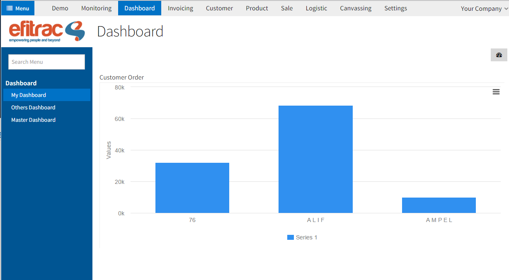
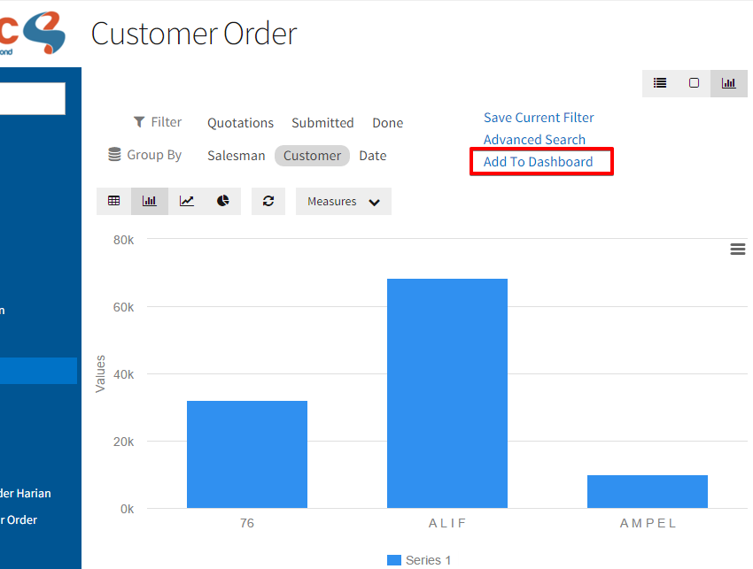
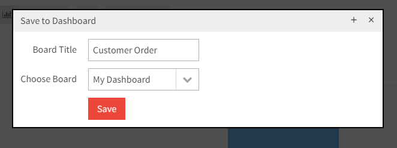
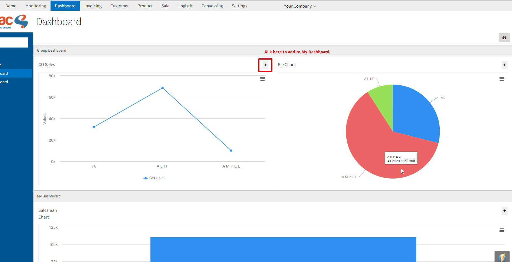

# Overview
Dashboard View adalah sebuah view yang bisa dapat menampilkan report-report dari semua module.

---

## How to create my Dashboard?

Setiap user secara otomatis pasti mempunyai sebuah private dashboard. Private dashboard ini dapat di akses pada menu Dashboard.

## How to add item to my Dashboard?

Untuk menambahkan item pada dashboard ada 2 cara yang bisa dilakukan:

### Add to my Dashboard from graph view

Untuk menambahkan item melalui graph view, user dapat membuka view graph dari model yang ingin dilihat.
Misalkan, model yang digunakan adalah *Customer Order*. Setelah membuka tampilan graph view, data-data akan disajikan dalam bentuk chart atau table.

Setelah itu, pilih option *Add to Dashboard* dan masukan judul report dan pilih tujuan dashboard.

### Add to my Dashboard from Other Dashboard

User juga bisa menambahkan item dashboard melalui menu *Other Dashboard*.
*Other Dashboard* berisi list-list dashboard group yang dapat dilihat oleh user yang login sesuai dengan group yang dimiliki.
Cara menambahkan adalah dengan menekan button plus disamping judul pada tiap item Dashboard.

Secara otomatis, item dashboard itu akan ditambahkan pada my dashboard.

## Further developments ?

1. Setiap user bisa membuat dashboard lebih dari 1.
2. Dashboard bisa dibuat berdasarkan modul-modul yang ada.
3. Bisa memilih template dashboard.